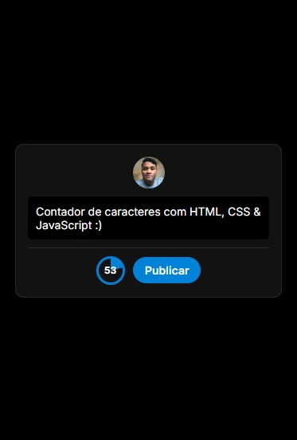
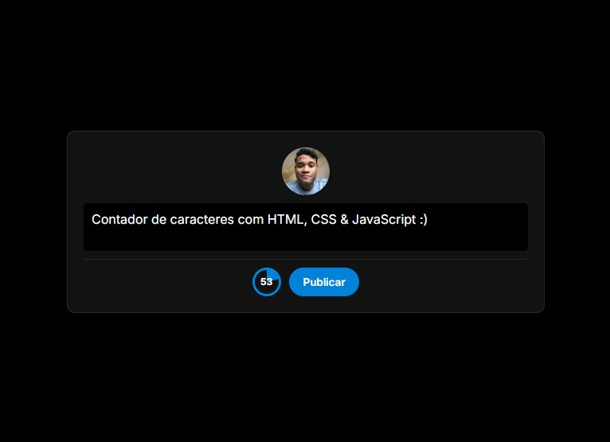

<h1 align="center"> Contandor de Caractere </h1>

[comment]: <> (Adicione o seu usuário  e o nome do repositório)

<p align="center">
  <image
  src="https://img.shields.io/github/languages/count/ojonatasquirino/contador-caractere"
  />
  <image
  src="https://img.shields.io/github/languages/top/ojonatasquirino/contador-caractere"
  />
  <image
  src="https://img.shields.io/github/last-commit/ojonatasquirino/contador-caractere"
  />

</p>

# sumário 

- [objetivos](#id01)
- [tecnologias utilizadas](#id02)
- [ambiente de codificação](#id03)
- [responsividade](#id04)
- [clonagem e instalação](#id05)
- [autoria](#id06)


# objetivos <a name="id01"></a>

<div  align='center'> 
  
Construir um contador de caracteres diferenciado, assim como o utilizado pelo X e Threads. Nesse mini projeto utilizo HTML, CSS e JavaScript para transformar um simples contador de caracteres em uma feature interativa. Esse projeto é um desafio da **<a href='https://codante.io'>codante.io</a>**.

</div>


# tecnologias utilizadas <a name="id02"></a>

<div  align='center'> 


</div>

# ambiente de codificação <a name="id03"></a>

<div  align='center'> 


</div>


# responsividade  <a name="id04"></a>

## mobile 



## tablet



## desktop 


# clonagem e instalação <a name="id05"></a>

Clone este repositório usando o comando no seu terminal:

```bash
git clone https://github.com/ojonatasquirino/contador-caractere.git
```

# autoria <a name="id06"></a>

[comment]: <> (Adicione seu nome e função)

<h3 align='center'> @ojonatasquirino • desenvolvedor front-end
 </h3>

#

<div  align='center'>

[](https://www.linkedin.com/in/jonatasquirino/)
<a href = "mailto:quirinoj02@gmail.com">
</a>
[](https://www.tabnews.com.br/ojonatasquirino) [](https://www.github.com/ojonatasquirino)
</div>
